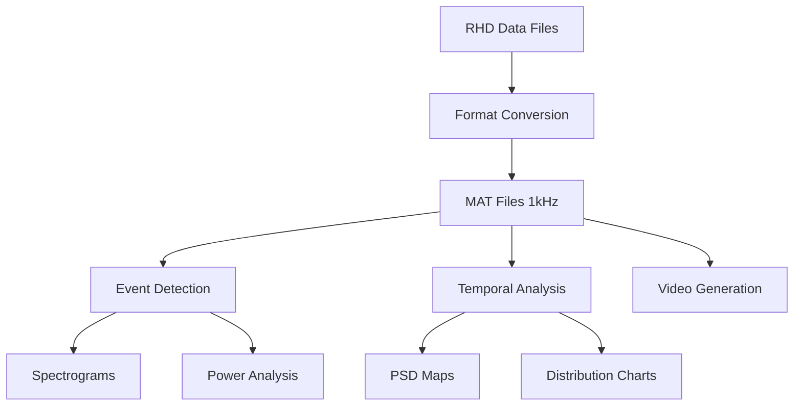

# tFUS-EEG-ToolKit

[](https://www.mathworks.com/products/matlab.html)
[](https://www.python.org/downloads/)
[](https://opensource.org/licenses/MIT)

A comprehensive MATLAB/Python toolkit for analyzing EEG data from transcranial focused ultrasound (tFUS) experiments, with specialized tools for tic event detection and temporal analysis.

## Overview

This toolkit provides a complete pipeline for processing and analyzing EEG recordings from tFUS experiments, including:
- Data format conversion (Intan RHD to MATLAB)
- Event detection using spectrograms and peak analysis
- Temporal distribution analysis of detected events
- Video visualization of EEG signals
## Features

- **Automated RHD to MAT conversion** with intelligent downsampling
- **Tic event detection** using RMS-based spike detection with Low-Frequency validation
- **Temporal analysis** comparing STIM vs SHAM conditions
- **High-quality visualizations** including spectrograms, PSD maps, and EEG videos
- **Batch processing** capabilities for multiple files

## Installation

### Prerequisites

#### MATLAB Requirements
- MATLAB R2018b or later
- Signal Processing Toolbox
- Statistics and Machine Learning Toolbox

#### Python Requirements
```bash
pip install numpy matplotlib scipy opencv-python h5py tqdm
```

### Setup
```bash
git clone https://github.com/yourusername/tFUS-EEG-ToolKit.git
cd tFUS-EEG-ToolKit
```

## Usage

### 1. Data Conversion (RHD to MAT)

Convert Intan RHD2000 files to MATLAB format:

```matlab
cd '0. rhd-mat converter (downsample)'
rhd2plot_samplerate
```

This will:
- Prompt for RHD file selection
- Extract amplifier data
- Downsample to 1 kHz if needed
- Save as `.mat` file with `raw_data` variable

### 2. Tic Event Detection and Spectrogram Analysis

Analyze EEG data for tic events:

```matlab
cd '1. Tic Event Based Spectogram:EEG Analysis'
eegSpectogram_v9_histogram_v3
```

Features:
- Interactive mode selection (batch/single file)
- RMS-based event detection
- Low-Frequency (0.5-4 Hz) power validation
- Spectrogram generation with event markers
- Relative power analysis across frequency bands

### 3. Temporal Distribution Analysis

Compare temporal patterns between STIM and SHAM conditions:

```matlab
cd '2. Peak Temporal Distrubution'
tFUS_EventAnalyzer_v3
```

This generates:
- Temporal PSD maps with z-score overlays
- Stacked bar charts of peak distributions
- Excel output with raw data
- Publication-ready figures

### 4. EEG Video Generation

Create video visualizations of EEG signals:

```bash
cd '3. EEG Monitor (200 dpi, 30 fps for Fs=1000Hz)'

# For adaptive scaling
python final.py

# For fixed ±5000 µV scaling
python final_fixed5000uv.py
```

## Data Format

### Input
- **RHD files**: Intan RHD2000 format
- **MAT files**: Must contain `raw_data` field with EEG sampled at 1 kHz

### Output
- **MAT files**: Processed data with detected events
- **Figures**: PNG/FIG format spectrograms and analyses
- **Videos**: MP4 format EEG visualizations
- **Excel**: Temporal analysis results

## Project Structure

```
tFUS-EEG-ToolKit/
├── 0. rhd-mat converter (downsample)/
│   ├── read_Intan_RHD2000_file.m    # Intan file reader
│   └── rhd2plot_samplerate.m        # Main conversion script
├── 1. Tic Event Based Spectogram:EEG Analysis/
│   ├── eegSpectogram_v9_histogram_v3.m  # Main analysis script
│   └── computeLogSpectrogram.m          # Helper function
├── 2. Peak Temporal Distrubution/
│   ├── tFUS_EventAnalyzer_v3.m      # Main temporal analysis
│   ├── plotTemporalPSDmap.m         # Visualization function
│   └── analysis/output/             # Results directory
└── 3. EEG Monitor (200 dpi, 30 fps for Fs=1000Hz)/
    ├── final.py                     # Adaptive scaling video
    └── final_fixed5000uv.py         # Fixed scaling video
```

## Analysis Pipeline



## Citation

If you use this toolkit in your research, please cite:

```
[in preparation]
```

## Acknowledgments

- Intan RHD file reader based on [Intan Technologies MATLAB file readers](https://www.intantech.com/downloads.html?tabSelect=Software&yPos=0)
- Developed for tFUS-EEG research at KAIST EE (Daejeon, South Korea).

## License

This project is licensed under the MIT License - see the [LICENSE](LICENSE) file for details.

## Contributing

Contributions are welcome! Please feel free to submit a Pull Request.

## Contact

For questions or issues, please open an issue on GitHub or contact [mhjonathan@gm.gist.ac.kr].
