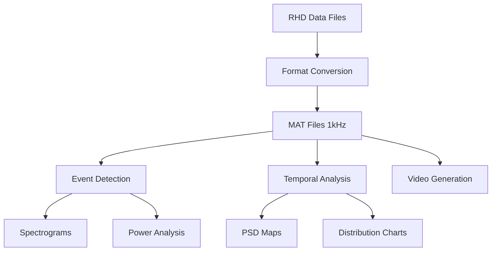

# Electrophysiology (EEG)-ToolKit

[](https://www.mathworks.com/products/matlab.html)
[](https://www.python.org/downloads/)
[](https://opensource.org/licenses/MIT)

### This repository was used in this work [(IEEE TNSRE, 2025)](https://ieeexplore.ieee.org/abstract/document/11230828/)

Toolkit provides a comprehensive and modular framework for the analysis of EEG data derived from preclinical models of epilepsy. It integrates pre-optimized signal processing algorithms specifically engineered for the robust detection and temporal delineation of Tourette-like tic phenomena in both transgenic and chemically induced rodent models of neurological pathology. All graphical outputs are publication-ready and conform to clinical electrophysiological conventions—i.e. seamless juxtaposition with behavioral video recordings for multimodal analysis.
+) Due to recent high traffic on this repo, I started translating these MATLAB codes to Python. MATLAB is still the convention in neuroscience. **Feel free to let me know if you find any errors or have suggestions to myunghyun@snu.ac.kr.**

## Overview

This toolkit provides a complete pipeline for processing and analyzing EEG recordings from tFUS experiments, including:
- Data format conversion (Intan RHD to MATLAB)
- Event detection using spectrograms and peak analysis
- Temporal distribution analysis of detected events
- Video visualization of EEG signals
## Features

- **Automated RHD to MAT conversion** with intelligent downsampling
- **Tic event detection** using RMS-based spike detection with Low-Frequency validation
- **Temporal analysis** comparing STIM vs SHAM conditions
- **High-quality visualizations** including spectrograms, PSD maps, and EEG videos
- **Batch processing** capabilities for multiple files

## Installation

### Prerequisites

#### MATLAB Requirements
- MATLAB R2018b or later
- Signal Processing Toolbox
- Statistics and Machine Learning Toolbox *

#### Python Requirements
- Python 3.11 or newer

Install the Python dependencies with:
```bash
pip install -r requirements.txt
```

### Setup
```bash
git clone https://github.com/myunghyunj/electrophysiology-ToolKit.git
cd electrophysiology-ToolKit
```

## Usage

### Quick Start with Sample Data

The repository includes two sample MAT files in `_EEG:EMG Dataset (STIM, SHAM 1ea each)/`:
- `example_SHAM_A.mat` - Example sham condition data
- `example_STIM_A.mat` - Example stimulation condition data

These files are ready to use with Components 1-3 of the pipeline (no conversion needed).

### 1. Data Conversion (RHD to MAT)

Convert Intan RHD2000 files to MATLAB format:

```matlab
cd '0. rhd-mat converter (downsample)'
rhd2plot_samplerate
```

This will:
- Prompt for RHD file selection
- Extract amplifier data
- Downsample to 1 kHz if needed
- Save as `.mat` file with `raw_data` variable

### 2. Tic Event Detection and Spectrogram Analysis

Analyze EEG data for tic events:

```matlab
cd '1. Tic Event Based Spectogram:EEG Analysis'
eegSpectogram
```

Python port:

```bash
python '1. Tic Event Based Spectogram:EEG Analysis/eeg_spectrogram.py' \
  '_EEG:EMG Dataset (STIM, SHAM 1ea each)/example_STIM_A.mat' \
  --output-dir analyzed_figures_py --save-eps
```

Features:
- Interactive MATLAB workflow plus non-interactive Python CLI
- RMS-based event detection
- Low-Frequency (0.5-10 Hz) power validation
- Spectrogram generation with event markers
- CSV export of detected events per file
- MATLAB-parity 4-panel output: filtered EEG, filtered EMG, EEG spectrogram, EMG spectrogram
- Optional `--save-eps` export for vector outputs on publication workflows

### 3. Temporal Distribution Analysis

Compare temporal patterns between STIM and SHAM conditions:

```matlab
cd '2. Peak Temporal Distrubution'
tFUS_EventAnalyzer_final
```

Python port:

```bash
python '2. Peak Temporal Distrubution/temporal_peak_distribution.py' \
  --stim '_EEG:EMG Dataset (STIM, SHAM 1ea each)/example_STIM_A.mat' \
  --sham '_EEG:EMG Dataset (STIM, SHAM 1ea each)/example_SHAM_A.mat' \
  --output-dir analysis/output_py
```

This generates:
- Temporal PSD maps with z-score overlays
- Stacked bar charts of peak distributions
- Raw-data CSV/XLSX export for downstream analysis
- Temporal PSD map plus mirrored z-score distribution plot
- Publication-ready figures (PNG + EPS for vector workflows)

### 4. EEG Video Generation

Create video visualizations of EEG signals:

```bash
cd '3. EEG Monitor (1600 dpi, 30 fps for Fs=1000Hz)'

# For adaptive scaling
python final.py

# For fixed ±5000 µV scaling
python final_fixed5000uv.py
```

Local smoke test for video renderer (small/fast run):

```bash
python '3. EEG Monitor (1600 dpi, 30 fps for Fs=1000Hz)/final.py' \
  '_EEG:EMG Dataset (STIM, SHAM 1ea each)/example_STIM_A.mat' \
  --window 1 --fps 2 --output /tmp/eeg_video_smoke.mp4
```

### 4.5 Unified Python CLI launcher

If you want one terminal entry point for all Python tools (tasks 1-4), run:

```bash
python tool.py
```

The launcher prompts for a task number, accepts drag-dropped file or folder paths for tasks 1, 2, and 4, and supports either a single `.mat` file or a glob pattern for task 3.

### 5. Locomotion Analysis Tools

This section explains for head-tracking locomotion workflows that connect DeepLabCut (DLC) outputs to time-binned distance analysis.

#### Preprocess with DeepLabCut (head)
```bash
cd '4. Locomotion Analysis Tools'
python locomotion_analysis.py preprocess raw/*.csv --output-dir python_output
```
```matlab
dlc_head_tracking_resampled
```
- Place DLC CSV exports in `raw/` and ensure the body part `head` exists in the header.
- Include `SHAM` or `STIM` in filenames to enable group-based analysis later.
- Python outputs per CSV: `<basename>_head_tracking_3fps.csv`, `<basename>_head_tracking_3fps.xlsx`, `<basename>_head_analysis_3fps.png`, and `<basename>_head_analysis_3fps.eps`.

#### Analyze time-binned locomotion
```bash
python locomotion_analysis.py analyze python_output --mm-per-pix 0.533 --bin-size-min 5 --output-dir python_output
```
```matlab
analyze_binned_locomotion
```
- When prompted, enter:
  - `bin_size_min` (e.g., 5)
  - `mm_per_pix` (e.g., 0.533)
  - Tip: `mm_per_pix = known_length_mm / measured_length_pixels` (use a ruler or arena dimension).

Outputs:
- Figure: `binned_locomotion_<bin>min.(png|eps)` (mean ± SEM per bin; SHAM vs STIM; individual points; per-bin n).
- Spreadsheet: `binned_locomotion_summary_<bin>min.(csv|xlsx)` with `Bin`, `SHAM_Mean/SEM/N`, `STIM_Mean/SEM/N`.
- Console: per-group totals (mean ± SEM, range) and average per-bin distance.

Notes:
- If no `*_head_tracking_3fps.xlsx` are found, ensure the preprocessing step above has been run and files reside here (or in `head_tracking_results/`).
- Grouping is determined by `SHAM`/`STIM` appearing in filenames (case-insensitive).

#### Method (at a glance)
- Convert `Time_sec` → minutes; number of bins = `ceil(max(Time_min) / bin_size_min)`.
- Sum distances within half-open intervals `[start, end)` per bin.
- Build an animal-by-bin matrix (NaN-padded) and compute per-bin mean and SEM using NaN-aware operations.
- Save a SHAM vs STIM figure and write the per-bin summary to Excel.

#### File discovery and grouping
- Searches current folder for `*_head_tracking_3fps.xlsx`; if none are found, searches `head_tracking_results/`.
- Filenames containing `SHAM` → SHAM group; containing `STIM` → STIM group.
- If no files are found, run preprocessing first (`dlc_head_tracking_resampled.m`).

#### Requirements
- MATLAB (R2018b or newer recommended).
- Ability to read `.xlsx` via `readtable`.
- If Statistics Toolbox is unavailable, replace `nanmean`/`nanstd` with `mean(...,'omitnan')` and `std(...,'omitnan')`.
- DeepLabCut CSV exports with a `head` body part, placed in `raw/`.

#### Troubleshooting
- "No head tracking output files found": ensure files match `*_head_tracking_3fps.xlsx` and are in this folder or `head_tracking_results/`.
- "Invalid bin size / mm-per-pixel": enter positive numeric values when prompted.
- Empty or zero distances: the script warns if an input file has no valid distance data.
- Missing columns: confirm your Excel files have `Time_sec` and `Distance_pixels` headers.
- DLC preprocessing: "No head marker found": ensure your DLC export includes a `head` body part in the header.

#### Reproducibility notes
- Binning uses half-open intervals `[start, end)` to avoid double-counting boundary samples.
- Distances are reported in millimeters using `Distance_mm = Distance_pixels * mm_per_pix`.
- Per-bin sample sizes (N) reflect the number of animals contributing non-NaN values to each bin.

## Data Format

### Input
- **RHD files**: Intan RHD2000 format
- **MAT files**: Must contain `raw_data` field with EEG sampled at 1 kHz

### Output
- **MAT files**: Processed data with detected events
- **Figures**: PNG/FIG format spectrograms and analyses
- **Videos**: MP4 format EEG visualizations
- **Excel**: Temporal analysis results

## Project Structure

```
electrophysiology-ToolKit/
├── 0. rhd-mat converter (downsample)/
│   ├── read_Intan_RHD2000_file.m    # Intan file reader
│   └── rhd2plot_samplerate.m        # Main conversion script
├── 1. Tic Event Based Spectogram:EEG Analysis/
│   ├── eegSpectogram.m              # Main analysis script
│   └── computeLogSpectrogram.m     # Helper function
├── 2. Peak Temporal Distrubution/
│   ├── tFUS_EventAnalyzer_final.m   # Main temporal analysis
│   ├── plotTemporalPSDmap.m         # Visualization function
│   └── analysis/output/             # Results directory
├── 3. EEG Monitor (1600 dpi, 30 fps for Fs=1000Hz)/
│   ├── final.py                     # Adaptive scaling video
│   └── final_fixed5000uv.py         # Fixed scaling video
└── 4. Locomotion Analysis Tools/
    ├── analyze_binned_locomotion.m   # Time-binned distance analysis (SHAM vs STIM)
    └── dlc_head_tracking_resampled.m # DLC CSV → 3 fps tracking Excel
```

## Analysis Pipeline


```mermaid
graph TD
    A[RHD Data Files] --> B[Format Conversion]
    B --> C[MAT Files 1kHz]
    C --> D[Event Detection]
    C --> E[Temporal Analysis]
    D --> F[Spectrograms]
    D --> G[Power Analysis]
    E --> H[PSD Maps]
    E --> I[Distribution Charts]
    C --> J[Video Generation]
```

## Citation

If you use this toolkit in your research, please cite:

```
[Publication : Paper Under Review]
[Authors : Kim, Kang, **Jeong** et al.]
[Year : 2025]
```

## Acknowledgments

- Intan RHD file reader based on [Intan Technologies MATLAB file readers](https://www.intantech.com/downloads.html?tabSelect=Software&yPos=0)
- Developed for tFUS-EEG research at KAIST EE (Daejeon, South Korea).

## License

This project is licensed under the MIT License - see the [LICENSE](LICENSE) file for details.

## Contributing

Contributions are welcome! Please feel free to submit a Pull Request.

## Contact

For questions or issues, please open an issue on GitHub or contact [myunghyun@snu.ac.kr].
